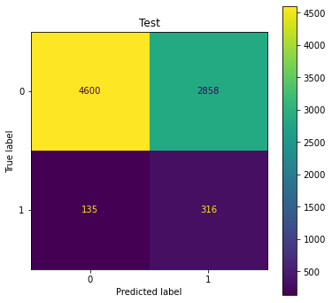

# Predicting Hospital Readmission Using Discharge Notes

## Authors
* Arthur Kim

## Table of Contents
* [Overview](#overview)
* [Business Understanding](#business-understanding)
* [Data Understanding](#data-understanding)
* [Data Preparation](#data-preparation)
* [Model_Analysis](#model-analysis)
* [Conclusions_and_Next_Steps](#conclusions_and_next_steps)
* [Contributors](#contributors)
* [Project Structure](#project-structure)

## Overview
Hospital readmissions are costly for health systems and payers. The average readmission cost in 2016 was $14.4K. This is why one of the metrics payers use to assess healthcare systems and medical providers is 30-day readmission rate. The Centers for Medicare & Medicaid Services (CMS) has implemented the [Hospital Readmissions Reduction Program](https://www.cms.gov/Medicare/Medicare-Fee-for-Service-Payment/AcuteInpatientPPS/Readmissions-Reduction-Program) (HRRP), which incentivizes providers by tying reimbursements with readmission rates. However, according to the [Agency for Healthcare Research and Quality (AHRQ)](https://www.hcup-us.ahrq.gov/reports/statbriefs/sb248-Hospital-Readmissions-2010-2016.jsp), readmission rates in the US have stayed relatively consistent from 2010 to 2016, as see in the figure below. Based on a [study](https://jamanetwork.com/journals/jamainternalmedicine/fullarticle/2498846) conducted by the University of California San Francisco (UCSF), approximately 27% of 30-day readmissions are preventable.

## Business Understanding
ACME Health, a large payor based in Boston, MA, has hired Flatiron Consulting to help prevent their high-risk patients from being readmitted to the hospital, especially those that end up in the ICU. For this project, they partnered with Beth Israel Deaconess Medical Center in Boston, MA, to provide access to the medical center's patient data. After reviewing the data, I have decided to create a model that utilizes the patient discharge summaries to predict whether or not the patient will likely be readmitted to the ICU within 30-days post discharge. I plan to then merge the results from modeling the discharge notes with other patient data features and run the models again to see if I can improve the performance of the model. ACME Health can use this model to help predict any future patients, so that they can focus on and follow up with these patients post discharge.

## Data Understanding
The dataset contains ~60K patient admission claims data of >50K patients who were admitted to the critical care units of the Beth Israel Deaconess Medical Center from 2001 to 2012. The dataset is from [MIMIC](https://mimic.mit.edu/) database that is owned by the Massachusetts Institute of Technology (MIT). In order to have access to the database, you have to be credentialed under [PhysioNet](https://physionet.org/settings/credentialing/) and have to take a short bioethics course. Therefore, there is no data in this repo.

The following datasets were used for this project:
* ADMISSIONS.csv: every unique admission per patient
* NOTEEVENTS.csv: deidentified notes, including discharge summaries
* CPTEVENTS.csv: procedures recorded as Current Procedural Terminology (CPT) codes
* DIAGNOSES_ICD.csv: hospital assigned diagnoses
* DRGCODES.csv: diagnosis Related Groups (DRG)
* PATIENTS.csv: every unique patient in the database
* PROCEDURES_ICD.csv: patient procedures
* SERVICES.csv: clinical service under which a patient is registered

## Data Preparation
First, individual datasets were cleaned by removing any unnecessary columns. Some rows were removed based on table specific criteria, for example, in the NOTEEVENTS.csv, there was a column that indicated if the note contained errors, and these notes were dropped. For tables that had rows for each individual code (CPT, DRG, etc.) per patient and admission, I grouped these codes into one row. For the admissions dataset, I wanted to classify if an admission would have a subsequent unplanned readmission within 30 days after discharge. For those that fit this criterion, I created the target column "READMISSION" and set the value equal to one, while all other values were zero. 

In addition, I created a column for the age of the patient by subtracting the discharge date with the date of birth. However, the MIMIC database purposely shifted all patients who are above 89 to have an age of 300 to protect their identity. Therefore, I made the assumption that any patient who was 300 years old based on the data was actually 90. Then, all the datasets were merged together based on either the patient ID ('SUBJECT_ID') or the admission ID (HADM_ID). With the merged dataset, I further dropped any columns that were unnecessary. Since most of the columns were categorical, I filled all the null values with the string "UNKNOWN".

For the text data, I removed any unnecessary phrases such as line break indicators ("\n") and removed all punctuations and numbers. I lowercased all the words. I tokenized, stemmed, and then lemmatize the words. I rejoined the words into one string file so that it can be processed through vectorizers later in the modeling step.

Below is the figure that shows the important words that indicate readmissions using a vectorizer and logistic regression model using functions derived from [Insight Data Science](https://blog.insightdatascience.com/how-to-solve-90-of-nlp-problems-a-step-by-step-guide-fda605278e4e). In the positive case, we see certain medical conditions such as subdural (hematoma), diabetic ketoacidosis (dka), tracheostomy, and cancer. However, in the irrelevant cases, it is no surprise to see the word 'expired', since those who have died in the hospital will not be readmitted. In addition, terms such as hospice, DNR (do-not-resuscitate), and palliative indicate patients who are reaching their end-of-life care, which explains why some of them are not readmitted.

## Model Analysis
I tested out 7 models in addition to a dummy model for analyzing the discharge notes:

<ol start="0">
  <li> Dummy Classifier Model (using stratify)</li>
  <li>Logistic Regression</li>
  <li>Multinomial Naive Bayes</li>
  <li>Random Forest</li>
  <li>K-Nearest Neighbors</li>
  <li>Decision Tree</li>
  <li>Gradient Boost</li>
  <li>Ensemble (Voting)</li>
</ol>

One thing to consider was the class imbalance. There were ~3K positive cases and ~50K negative cases. I tried three methods to mitigate the class imbalance:
1. Undersampling the negative case
2. Passing in class weights
3. Implementing SMOTE

However, the undersampling of the negative case worked the best. In addition, the tfidf vectorizer worked better than the count vectorizer. Therefore, for models 1-7, I used the undersampling method and the tfidf vectorizer to model through a pipeline. I also wanted to focus on the recall/sensitivity score for this project because I wanted to make sure I had a lower false negative rate or accidently misclassifying those who are going to be readmitted as those who will not be readmitted. When I focused on recall for my grid search, I noticed that in some cases, the recall was very high, but accuracy was very low. I decided to look at both recall and accuracy, and tried to find the model that had good scores for both, while still prioritizing recall.

For the dummy model (model 0) without any class imbalance mitigation, the recall score 7%. As for models 1-7, the following figure shows the recall/sensitivity and accuracy scores.

I found that model 7, the ensemble model had the best scores. Though model 4 had a higher recall score, the accuracy score was much lower than that of model 7. Therefore, I determined that model 7 was the best model. The following figure is the confusion matrix of the test sample of model 7.

I took the best model and ran the entire dataset through it. I merged the results with other patient data features such as demographics and diagnoses. However, I had two resulting dataframes. One with the predicted classes and one with the predicted probabilities. I took these datasets and ran them through the models again to see if I can improve the results. I found that the predicted classes dataframe had a better model than the predicted probabilities dataframe.

I tested out 7 models in addition to a dummy model:

<ol start="0">
  <li> Dummy Classifier Model (using stratify)</li>
  <li>Logistic Regression</li>
  <li>Gaussian Naive Bayes</li>
  <li>Random Forest</li>
  <li>K-Nearest Neighbors</li>
  <li>Decision Tree</li>
  <li>Gradient Boost</li>
  <li>Ensemble (Voting)</li>
</ol>

The following figure shows the recall/sensitivity and accuracy scores of the models with the dataframe that had the predicted classes.

I found that model 3, the random forest model had the best scores. The following figure is the confusion matrix of the test sample of model 3.

## Conclusions and Next Steps
The recall (75.6%) and accuracy score (63.8%) of the best model, the random forest model, are lower than ideal. Therefore, I do not recommend ACME health to use this model to classify if patients are likely to be readmitted within 30 days post discharge. Instead, I recommend the following for next steps:
* Obtain additional data outside of the ICU
* Obtain additional data from other health systems
* Implement additional models such as neural networks
* Review other patient data features that can help improve model performance
With more data, I can better fine tune the model to classify correctly which patients are likely to be readmitted.

## Contributors
- Arthur Kim  
    Github: [arthursjkim](https://github.com/arthursjkim) 
## Project Structure
├── 01_EDA.ipynb
├── 02_Modeling_NLP.ipynb
├── 03_Modeling_Additional_Features.ipynb
├── README.md
├── Readmission_Classification.pdf
└── images
