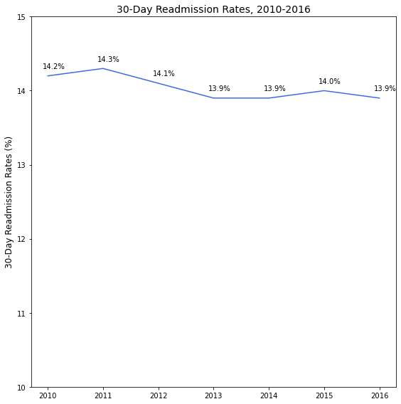

# Predicting Hospital Readmission Using Discharge Notes

## Authors
* Arthur Kim

## Table of Contents
* [Overview](#overview)
* [Business Understanding](#business-understanding)
* [Data Understanding](#data-understanding)
* [Data Preparation](#data-preparation)
* [Model_Analysis](#model-analysis)
* [Conclusions](#conclusions)
* [Contributors](#contributors)
* [Project Structure](#project-structure)

## Overview
Hospital readmissions are costly for health systems and payers. The average readmission cost in 2016 was $14.4K. That is why one of the metrics payers use to assess healthcare systems and medical providers is 30-day readmission rates. The Centers for Medicare & Medicaid Services (CMS) has implemented the [Hospital Readmissions Reduction Program](https://www.cms.gov/Medicare/Medicare-Fee-for-Service-Payment/AcuteInpatientPPS/Readmissions-Reduction-Program) (HRRP), which incentivizes providers by tying reimbursements with readmission rates. However, according to the [Agency for Healthcare Research and Quality (AHRQ)](https://www.hcup-us.ahrq.gov/reports/statbriefs/sb248-Hospital-Readmissions-2010-2016.jsp), readmission rates in the US has stayed relatively consistent from 2010 to 2016, as see in the figure below. Based on a [study](https://jamanetwork.com/journals/jamainternalmedicine/fullarticle/2498846) conducted by the University of California San Francisco (UCSF), approximately 27% of 30-day readmissions are preventable.

## Business Understanding
ACME Health, a large payor based in Boston, MA, has hired Flatiron Consulting to help prevent their high risk patients from being readmitted to the hospital, especially those that end up in the ICU. For this project, they partnered with Beth Israel Deaconess Medical Center in Boston, MA, to have access to the medical center's patient data. After reviewing the data, I have decided to create a model that utilizes the patient discharge summaries to predict whether or not the patient will likely be readmitted to the ICU within 30-days post discharge. ACME Health can use this model to help predict any future patients, so that they can focus on and follow-up with these patients post discharge.

## Data Understanding
The dataset contains ~60K patient admissions claims data of >50K patients  who were admitted to the critical care units of the Beth Israel Deaconess Medical Center from 2001 to 2012. The dataset is from [MIMIC](https://mimic.mit.edu/) database that is owned by the Massachusetts Institute of Technology (MIT). In order to have access to the database, you have to be credentialed under [PhysioNet](https://physionet.org/settings/credentialing/) and have to take a short bioethics course. Therefore, there is no data in the data folder as of now.

The following datasets were used for this project:
* ADMISSIONS.csv: every unique admissions per patient
* NOTEEVENTS.csv: deidentified notes, including discharge summaries
* CPTEVENTS.csv: procedures recorded as Current Procedural Terminology (CPT) codes
* DIAGNOSES_ICD.csv: hospital assigned diagnoses
* DRGCODES.csv: diagnosis Related Groups (DRG)
* PATIETNS.csv: every unique patient in the database
* PROCEDURES_ICD.csv: patient procedures
* SERVICES.csv: clinical service under which a patient is registered

## Data Preparation
First, individual datasets were cleaned by removing any unnecessary columns. Some rows were removed based on table specific criteria, for example, in the NOTEEVENTS.csv, there was a column that indicated if the note contained errors, and these notes were dropped. For tables that had rows for each individual code (CPT, DRG, etc.) per patient and admission, I grouped these codes into one row. For the admissions dataset, I wanted to classify if an admission would have a subsequent unplanned readmission within 30 days after discharge. For those that fit this criteria, I created the target column "READMISSION" and set the value equal to one, while all other values were zero. In addition, I created a column for the age of the patient by subtracting the discharge date with the date of birth. However, the MIMIC database purposely shifted all patients who are above 89 to have an age of 300 to protect their identity. Therefore, I made the assumption that any patient who was 300 years old based on the data was actaully 90. Then, all the datasets were merged together based on either the patient ID ('SUBJECT_ID') or the admission ID (HADM_ID). With the merged dataset, I further dropped any columns that were unnecessary. Since most of the columns were categorical, I filled all the null values with the string "UNKNOWN".

For the text data, I preprocessed it by removing any unnecessary phrases such as line break indicators ("\n") and removed all puncations and numbers. I lowercased all the words. I tokenized, stemmed, and then lemmatize the words. I rejoined the words into one string file so that it can be processed through vectorizers later in the modeling step.

## Model Analysis
I tested out 7 models in addition to a dummy model:

<ol start="0">
  <li> Dummy Classifier Model (using stratify)</li>
  <li>Logistic Regression</li>
  <li>Multinomial Naives Bayes</li>
  <li>Random Forest</li>
  <li>K-Nearest Neighbors</li>
  <li>Decision Tree/li>
  <li>Gradient Boost</li>
  <li>Ensemble (Voting)</li>
</ol>

One thing to consider was the class imbalance. There were ~3K positive cases and ~50K negative cases. I tried three methods to mitigate the class imbalance: undersampling the negative case, passing in class weights, and implementing SMOTE. However, the undersampling of the negative case worked the best. In addition, the tfidf vectorizer worked better than the count vectorizer. Therefore for models 1-7, I used the undersampling method and the tfidf vectorizer to model through a pipeline. I also wanted to focus on the recall/sensitivity score for this project because I wanted to make sure I had a lower false negative rate of accidently misclassifying those who are going to be readmitted as those who will not be readmitted.

For the dummy model (model 0), the recall score 6%. As for models 1-7, the following figure shows the recall scores.

[insert additional analysis on which model is the best after finishing fine tuning the model]

[insert image on top words for positive and negative cases]

Once I had processed the discharge summary text data, I took the predicted values using my best model and attached them to the other features of my dataset such as patient demographics and diagnoses. I ran this new dataset through models again, and the recall scores are shown in the figure below.

## Conclusions
[TBD]
## Contributors
- Arthur Kim  
    Github: [arthursjkim](https://github.com/arthursjkim) 
## Project Structure
[TBD]
